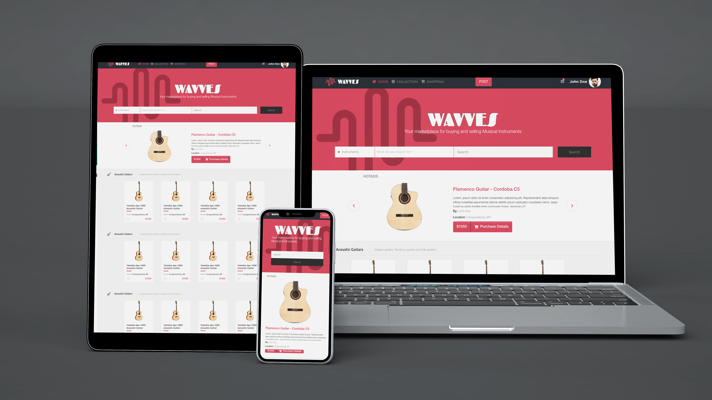

The goal in this project was to apply all the basic HTML & CSS functions the best way possible to wrap up all the knowledge acquired along the HTML & CSS section of Microverse Learning Program. It was built using Sass.



## Built With

- HTML & CSS
- FontAwesome
- SASS
- Bootstrap 4

## Live Demo

[Live Demo Link](https://ldelbel.github.io/music-store-website/)

## Getting Started

To get a local copy of the repository please run the following commands on your terminal:

```
$ cd <folder>
```

```
$ git clone https://github.com/acushlakoncept/conference-page.git
```

To install the required sass node modules

```
$ npm install -g sass

```

Run SASS on command line to automatically compile to style.css

```
$ npm run compile:sass

```
